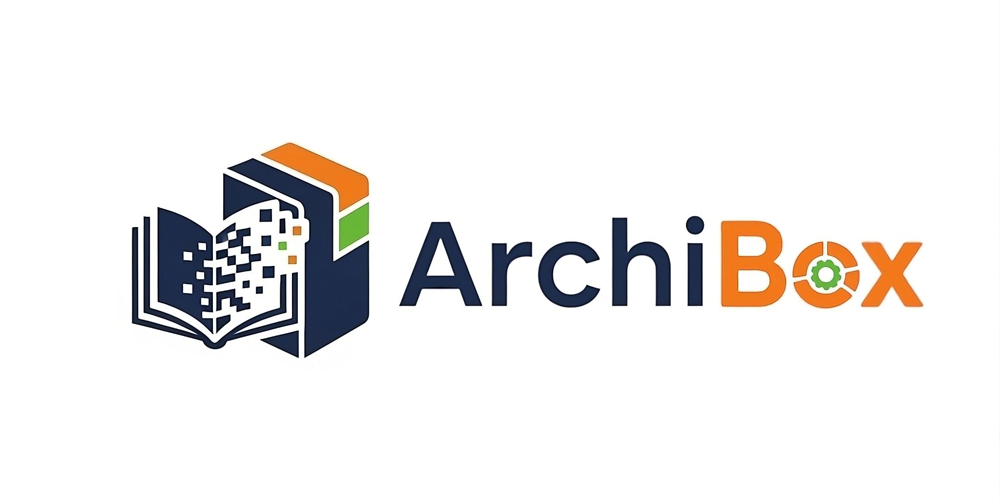

# 📦 Ingesoft2025-1G8 — ArchiBox  

## 🧠 Nombre del proyecto  
**ArchiBox** — Sistema de seguimiento para la digitalización de libros antiguos.

## 🐍 Nombre del grupo  
**TROUSER SNAKES**

## 👥 Contacto e integrantes

- 📧 **Camilo Andrés Liévano Rendón** — clievano@unal.edu.co  
- 📧 **Juan Mateo Rozo Torres** — jrozot@unal.edu.co  
- 📧 **Juan Diego Lasso Montaño** — julassom@unal.edu.co  
- 📧 **René Alejandro Barrero González** — rbarrero@unal.edu.co  

## 📝 Descripción del proyecto  
📚 ArchiBox es un rastreador del proceso de digitalización de libros pertenecientes al antiguo sistema de registro.  
Permite organizar, monitorear y mantener el flujo de trabajo desde la restauración hasta la digitalización final.

---
